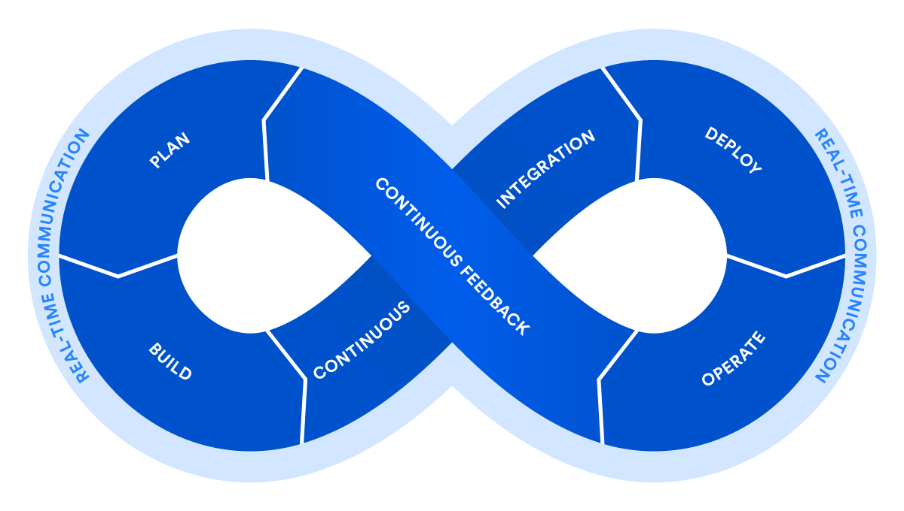

# Hi there 👋
My name is Said Silva and I'm a student of Computer Engineer who likes to handle the automatization and backend of my projects.

***
## Want to know more about me? 👋

&nbsp;&nbsp;&nbsp;&nbsp;
  &nbsp;&nbsp;&nbsp;
  &nbsp;

***
##Main Skills
 
- Python
 
 
- AWS
 
 
- Jenkins
 
 
- Docker
 
 
- Ansible
 
 
- Bash
 

<!--
**SaidS11/SaidS11** is a ✨ _special_ ✨ repository because its `README.md` (this file) appears on your GitHub profile.

Here are some ideas to get you started:

- 🔭 I’m currently working on ...
- 🌱 I’m currently learning ...
- 👯 I’m looking to collaborate on ...
- 🤔 I’m looking for help with ...
- 💬 Ask me about ...
- 📫 How to reach me: ...
- 😄 Pronouns: ...
- ⚡ Fun fact: ...
-->
